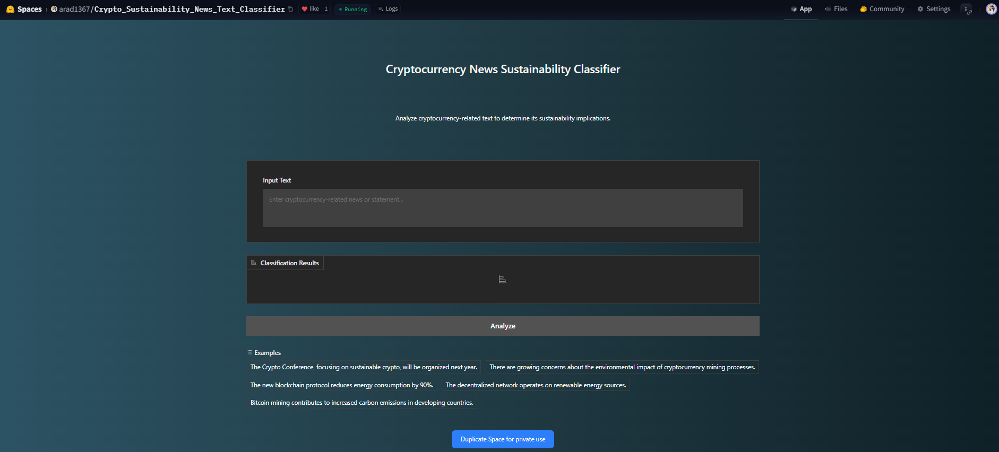

# Intelligent Sustainability: Evaluating Transformers for Cryptocurrency Environmental Claims

## Table of Contents
- [Overview](#overview)
- [Dataset](#dataset)
- [Models](#models)
- [Key Features](#key-features)
- [Live Demo](#live-demo)
- [Installation](#installation)
- [Usage](#usage)
- [Results](#results)
- [Contributing](#contributing)
- [Contact](#contact)

## Overview
This research project evaluates various transformer models for classifying cryptocurrency-related news and content through a sustainability lens. The project implements and compares multiple state-of-the-art transformer models to analyze environmental impact claims in cryptocurrency discussions.

## Dataset
The project uses a custom-curated dataset available on HuggingFace:
- **Dataset Link**: [sustainability_impact_crypto_data](https://huggingface.co/datasets/arad1367/sustainability_impact_crypto_data)
- **Labels**: Negative, Neutral, Positive (regarding environmental impact)

## Models
We evaluated five transformer models:
1. RoBERTa-large-MNLI (Best performing)
2. DistilBERT
3. Twitter-RoBERTa
4. Prompt-Guard-86M
5. FinBERT

The best performing model (RoBERTa-large-MNLI) is deployed and available at:
[sustainability_news_roberta-large-mnli_five_epochs](https://huggingface.co/arad1367/sustainability_news_roberta-large-mnli_five_epochs)

## Key Features
- Text classification of cryptocurrency environmental impact claims
- Comparative analysis of multiple transformer architectures
- Advanced evaluation metrics implementation
- Integration with Weights & Biases for experiment tracking
- User-friendly interface for model interaction

## Live Demo
Try the model in action:
[Crypto Sustainability News Text Classifier](https://huggingface.co/spaces/arad1367/Crypto_Sustainability_News_Text_Classifier)


## Installation
```bash
# Clone the repository
git clone https://github.com/arad1367/Intelligent_Sustainability_Paper.git
cd Intelligent_Sustainability_Paper

# Install requirements
use colab to install requirements

# Login to Hugging Face (required for model access)
from huggingface_hub import login
login()
```

## Usage
```python
# Load the dataset
from datasets import load_dataset
dataset = load_dataset("arad1367/sustainability_impact_crypto_data")

# Load the best performing model
from transformers import AutoTokenizer, AutoModelForSequenceClassification
model_name = "arad1367/sustainability_news_roberta-large-mnli_five_epochs"
tokenizer = AutoTokenizer.from_pretrained(model_name)
model = AutoModelForSequenceClassification.from_pretrained(model_name)
```

## Results
The best performing model (RoBERTa-large-MNLI) achieved:
- High accuracy in classifying environmental impact claims
- Robust performance across different types of cryptocurrency-related content
- Superior generalization compared to other tested models

Detailed evaluation metrics and comparative analysis are available in the code.

## Contributing
Contributions are welcome! Please feel free to submit a Pull Request. For major changes, please open an issue first to discuss what you would like to change.

## Contact
**Pejman Ebrahimi**
- Academic Email: pejman.ebrahimi@uni.li
- Personal Email: pejman.ebrahimi77@gmail.com
